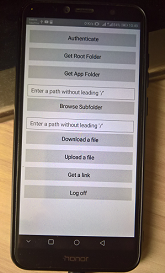

# Uno.OneDrive.Simple 
A wrapper around microsoft identity connector and microsoft graph api to access one drive content

## Screenshots

## Architecture
### [UnoODSimple.Shared](/UnoODSimple.Shared) - Shared part of code
### [UnoODSimple.Droid](UnoODSimple.Droid) - Android part of code
### [UnoODSimple.UWP](UnoODSimple.UWP) - "Universal" (Win10/Mobile) part of code
### [UnoODSimple.iOS](UnoODSimple.iOS) - iOS part of code
### [UnoODSimple.macOS](UnoODSimple.macOS) - MacOS part of code
### [UnoODSimple.Wasm](UnoODSimple.Wasm) - "Web" part of code (hello, webdev!))

## Install instructions
* Install newest Visual Studio 2022 (Preview or maybe RC) 
* Install .NET, Xamarin, Web dev. workloads
* Find and install .NET 5 and .NET Core 5 (optional, only if You interesting in WASM) 
* Install UNO Platform extension
   
Important note:  You will don't need a microsoft application id , and this is kind of magic! 
Thanx to fantastic  [OneDriveSimple](https://onedrive.live.com/redir?resid=40CFFDE85F1AB56A!2170&authkey=!ANdUUFzrZtx8eCY)
sample as cool base of OneDrive work example :)

## Changelog
### v1.0.*

Conditional framework's builds according to platform specifics.
  
Extending the HttpClient library to accommodate token acquisition.  

Methods for getting (listing) folder's childs. 

Implementing the Upload method (to send file content to drive). 

Provide a sample application.

# Contribute!
There's still a TON of things missing from this proof-of-concept (MVP) and areas of improvement 
which I just haven't had the time to get to yet.
- UI Improvements (for GTK, for example, or for each one of supported mutli-platforms)))
- Additional Language Packages
- Media Transferring Support: screenshots, etc. (for the brave)

## Solution Layout
Projects have a DOCs which expands on the internal functionality and layout of that project... it's good for your own R.E. 
There are no DOCs which explains all architecture, API, OneDride auth. and etc. yet... 
this is just my UNO beginning! =) 

With best wishes,

  [m][e] 2021

## Thanks!
I wanted to put down some thank you's here for folks/projects/websites that were invaluable for helping me get this project into a functional state:
* [Piotr Karocki](https://github.com/pkar70) - Andro2UWP project creator/author/developer
* [Leverson Carlos](https://github.com/LeversonCarlos) Author/Developer of some interesting projects like a OneDrive.Connector
* [Uno Platform](https://github.com/unoplatform) "Uno Momento" =)))))))))

## License
MIT License - see the [LICENSE](LICENSE) file for details.
